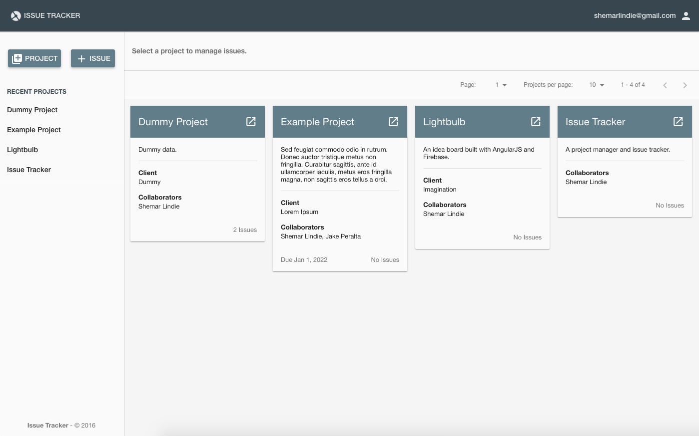

# Issue Tracker #
### Project management and issue tracking. ###

Demo: https://issue-tracker.shemarlindie.com/

See screenshots [here](screenshots).

#### REQUIREMENTS: ####
* Install Node 8.x (newer version may or may not work)
* Install bower globally: `npm install -g bower`
* Install gulp globally: `npm install -g gulp`
* Install composer: https://getcomposer.org/

## Project Setup ##
----

### Frontend

**Dependencies**

To install dev dependencies: 
> npm install

To install app dependencies:
> bower install

**Build Process**

To build app resources during development (less, etc..)
> gulp build

**- or -**

To build and watch for changes:
> gulp

**- or -**

To build for deployment:
> gulp dist

This will create the "dist/" folder with all essential app files to be uploaded to a server. (with minified JS)

**Note:** Unless stated otherwise, all commands must be run in the project's root folder.

### API

The latest backend for this project is implemented [here](https://github.com/shemarlindie/django-api).

Note: The original API in `src/api` is based on an old version Symfony framework and might be more trouble than it's worth to get up and running.